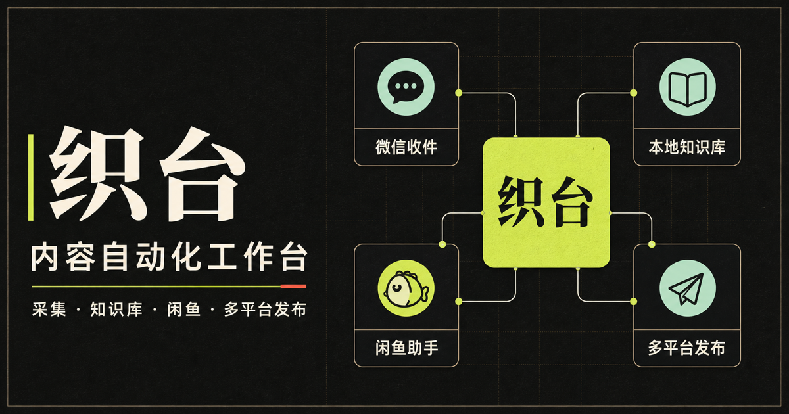

# 织台（Zhitai Workbench）

> Public Preview · v0.1.0-alpha.1

织台是一个面向个人创作者与小型内容团队的本地优先控制台：把素材入库、知识整理、任务状态、人工审核和可选的多平台适配器放进同一套工作流。

当前版本是公开预览版，不是完整产品，也不承诺所有平台能力开箱即用。仓库自带的核心可以在不配置平台账号的情况下运行；采集、分析、生成、通知、远程控制和发布等能力依赖用户自行安装并合法配置的外置引擎或服务。

[快速开始](#快速开始) · [能力与成熟度](#能力与成熟度) · [架构](#架构) · [安全与人工审核](#安全与人工审核) · [路线图](ROADMAP.md) · [参与贡献](CONTRIBUTING.md)

## 核心能力

仓库内可直接运行的部分包括：

- React 工作台与本地 Electron 外壳源码；
- 仅绑定回环地址的本地节点；
- SQLite 索引、内容包、任务队列、事件与状态接口；
- 知识库搜索、筛选、媒体预览、导入记录、修正历史和导出契约；
- BagIt 1.0 兼容的可验证备份、隔离恢复、新根迁移与可恢复回滚；
- 固定命令的服务管理、来源白名单、路径边界、可配置且配置后强制的 HMAC 校验，以及公开发布和部分服务控制的确认门；
- 面向外置采集、分析、生成、通知和发布引擎的适配层。

织台不会替你提供平台账号、登录态、模型额度、媒体授权或第三方程序的再分发权。没有配置外置引擎时，对应模块应显示为未配置、不可用或需要处理，而不是伪装成功。

## 能力与成熟度

| 领域 | 当前状态 | 边界 |
| --- | --- | --- |
| 本地节点与知识库 | 可运行 / Alpha | 本地任务、SQLite、内容包、检索与媒体接口可用；迁移前应自行备份 |
| Web 工作台 | 可运行 / Alpha | 可查看和操作本地节点；部分桌面能力只在 Electron 外壳中可用 |
| 桌面外壳 | Public Preview | 主要在 macOS 开发验证；尚无稳定、签名的跨平台发行包 |
| 采集 | 适配器预览 | 分享链接或媒体解析通常需要外置工具、登录态与平台许可 |
| 视频分析与生成 | 适配器预览 | ASR、OCR、镜头、视觉模型和生成服务均为可选外置能力；缺失字段必须明确标为 unavailable |
| 多平台发布 | 实验性 | 需要外置发布器和各平台登录；默认优先草稿，公开发布必须显式确认 |
| 闲鱼、X 收藏、手机控制与通知 | 实验性 | 依赖外置程序或已登录浏览器；可能受平台规则、风控和接口变化影响 |
| 安全性 | 预览阶段 | 已实现多项本地边界与审核门，但尚未完成独立安全审计 |

## 快速开始

### 环境

- Node.js 22.13.0 或更高版本；
- pnpm 11.19.0 或更高版本（建议通过 Corepack 启用）；
- Git；
- 当前支持的完整开发流程是 macOS 或带 POSIX shell 的环境。Linux 可用于核心与 CI 测试；原生 Windows 下本地节点可以尝试运行，但 dev、build、start 脚本的环境变量语法、桌面脚本和部分媒体探测尚未适配。

### 1. 获取并安装

~~~bash
git clone https://github.com/lt750965698-cyber/zhitai-workbench.git
cd zhitai-workbench
corepack enable
pnpm install --frozen-lockfile
~~~

### 2. 创建本地配置

~~~bash
cp local-agent/config.example.json local-agent/config.local.json
~~~

首次运行请先检查本地配置：

- 保持 host 为 127.0.0.1。虽然节点可接受其他回环写法，当前 Web 与桌面客户端仍固定连接 127.0.0.1:17890；
- 只保留实际需要的 allowedOrigins；
- 外置适配器默认保持关闭，确认来源、许可证、路径和账号授权后再逐项启用；
- 不要把 Cookie、令牌、密钥、二维码、手机号或真实素材路径提交到 Git。

local-agent/config.local.json 已被设计为本机配置；发布前仍应使用 git status 和密钥扫描工具复核。

### 3. 启动

在一个终端启动本地节点：

~~~bash
pnpm agent
~~~

在另一个终端启动工作台：

~~~bash
pnpm dev
~~~

打开终端显示的本地地址（通常是 http://localhost:3000），并检查节点：

~~~bash
curl http://127.0.0.1:17890/health
~~~

未配置第三方引擎时，核心工作台与本地节点仍可启动；采集、分析、生成和发布模块会保持受限状态。更完整的配置说明见 [开始使用](docs/GETTING_STARTED.md)。

### 4. 验证

~~~bash
pnpm lint
pnpm test:backup
pnpm run test:offline-e2e
pnpm test
~~~

pnpm test 会先执行生产构建，再运行 Node.js 测试。外置平台集成不应在默认测试中访问真实账号或真实内容。`test:offline-e2e` 使用全网络拒绝、临时 HOME/SQLite、合成媒体和假平台回执验证整链故障恢复，并在 `.artifacts/offline-e2e/` 生成机器可读 JSON。

## 可验证备份、恢复与迁移

织台提供 BagIt 1.0 兼容的目录型备份，使用 SQLite Online Backup API（旧版 Node 自动回退到 `VACUUM INTO`）生成包含已提交 WAL 的一致性单文件快照，并为内容包、队列、审计、生成、排期和脱敏平台回执生成逐文件 SHA-256。恢复始终先进入新建临时隔离目录；迁移只允许写入不存在的新根，且会暂停生成队列并把可执行发布排期改为待人工重新确认。

~~~bash
pnpm backup create --data-dir <dataDir> --knowledge-root <内容库> --output <新备份目录>
pnpm backup verify --backup <备份目录>
pnpm backup restore --backup <备份目录>
pnpm backup preview --backup <备份目录> --target-root <新迁移根>
pnpm backup migrate --backup <备份目录> --target-root <不存在的新迁移根>
pnpm backup rollback --target-root <迁移根> --migration-id <迁移编号>
~~~

创建和验证还会核对 BagIt `Payload-Oxum`、允许路径、敏感字段、SQLite 完整性、资产引用及业务计数。迁移会冻结发布排期、分析、生成和活动导入队列；无法解析的活动路径会阻止启用，失败副本与回滚副本都只做可恢复隔离改名，不删除当前用户数据。

完整命令、范围、排除策略、迁移/回滚和 RPO/RTO 见 [备份与恢复指南](docs/BACKUP_RESTORE.md)。

## 架构

~~~text
浏览器工作台 / Electron 外壳
              │
              │ 回环 HTTP 或受限 IPC
              ▼
        织台本地节点
  API · 队列 · 审核门 · 服务状态
        │                 │
        ▼                 ▼
 SQLite 索引         本地内容包与素材
        │
        │ 显式启用的适配器
        ▼
 外置采集 / 分析 / 生成 / 通知 / 发布引擎
~~~

核心数据和平台登录态应留在本机。外置引擎是独立进程或服务，不属于织台的 MIT 许可范围，也不会因为出现在配置示例中自动获得再分发许可。详见 [架构说明](docs/ARCHITECTURE.md)、[集成指南](docs/INTEGRATION.md)和[第三方声明](THIRD_PARTY_NOTICES.md)。

## 安全与人工审核

织台的默认信任边界是单个本地操作系统用户，不是公网多租户服务。

- 本地节点只允许绑定回环地址；不要通过端口转发、反向代理或容器映射把它直接暴露到局域网或公网。
- 浏览器来源使用 allowlist，服务命令来自本地固定配置。无 Origin 的本机客户端属于同一操作系统用户信任边界，当前可以调用本地写接口。
- 收件和遥控入口在配置共享密钥后会对每个请求强制校验 HMAC、时间窗和 nonce，不能通过省略签名头降级。明确未配置密钥时，仅接受精确白名单 Origin，或来自回环地址且没有 Origin 的同用户本机客户端。
- 素材路径需要经过允许根目录和真实路径校验，避免符号链接逃逸。
- 凭据应放在系统钥匙串、受保护的本地文件或进程环境中，不进入仓库、日志、状态接口或导出包。
- 公开发布和部分受管理服务操作已有显式确认门；其他变更接口仍依赖回环地址、Origin 与同用户信任假设，尚未完成统一授权审计。
- 使用者必须对所有高影响操作保留人工审核：核对内容权利、事实、标题、账号、平台、可见范围和计划时间。
- 平台草稿不等于公开发布成功；CLI 或接口返回成功也不能替代平台端人工核验。
- 遇到验证码、登录失效、风控、版权不确定或内容安全疑问时，应停止自动化并转人工处理。

请通过 [安全政策](SECURITY.md) 私下报告漏洞。威胁模型与部署边界见 [安全模型](docs/SECURITY_MODEL.md)。

## 合法与授权使用

只处理以下内容：

- 你本人创作并拥有相应权利的内容；
- 权利人明确授权你下载、分析、改编或发布的内容；
- 法律与平台规则明确允许处理的公开内容。

禁止使用织台绕过付费、访问控制、加密、验证码、版权保护或平台风控；禁止冒充他人、批量骚扰、未经授权抓取私密数据或发布侵权内容。移除水印、下载公开可见内容或生成相似作品都不当然意味着取得版权或发布权。

生成式 AI 的输出必须经过人工核对。使用者负责遵守适用法律、平台条款、模型服务条款、隐私要求、广告与知识产权规则。详见 [内容与授权政策](docs/CONTENT_POLICY.md)。

## 外置引擎

项目提供的是适配边界，不是第三方工具合集。外置引擎必须由使用者自行从上游取得并核验：

1. 选择固定版本或提交；
2. 阅读许可证、服务条款和数据处理方式；
3. 在隔离环境中安装并限制为回环访问；
4. 仅为已授权账号和内容启用；
5. 在升级前重新审计接口、权限和许可证。

仓库包含一个需要界面确认的可选模块更新器，它会从固定 GitHub 上游下载源码、DMG 或更新文件到本机私有 runtime。下载地址会绑定到精确 owner、仓库、Release tag 和文件路径；GitHub Release 二进制与热更新清单必须通过 SHA-256，热更新文件还必须逐文件提供 SHA-256，缺失时会拒绝更新。GitHub 自动生成的源码归档目前没有统一的 Release digest，项目也没有为所有上游验证发布者签名，因此启用前仍应由使用者核对固定版本、许可证与上游资产。MatrixMedia 的本地安装流程还会修改应用的后台运行标记并进行 ad-hoc 重签名，修改后的副本不再等同于上游原始签名产物。

许可证不明确、限制再分发或与本项目发行方式不兼容的源码和二进制不得打包进织台发行物。尤其不要复制、分叉或捆绑未提供明确许可证的浏览器脚本；织台只保留可替换的接口契约。

## 运营指标与复盘

运营指标合同复用知识库、`metric_snapshot`、生成成片、发布回执和创作审核结构；补充四态平台指标、成片到多平台帖子的血缘、1h/24h/7d/30d 快照、反馈漏斗、单变量实验卡及 D7/D14/D30 复盘。`submitted` / `success` 只表示平台接收，绝不自动计作公开。

- 合同与口径：[docs/OPERATIONS_METRICS_CONTRACT.md](docs/OPERATIONS_METRICS_CONTRACT.md)
- 后续接入：[docs/OPERATIONS_INTEGRATION.md](docs/OPERATIONS_INTEGRATION.md)
- 合成示例：[docs/examples/operations-review.synthetic.md](docs/examples/operations-review.synthetic.md)
- 只读报告：`node scripts/operations-report.mjs --help`
- 专项测试：`pnpm run test:ops`

合成模式只能用于隔离验收，并在报告中强制标记；它不登录平台、不修改账号、不执行真实发布，也不能代表真实运营结果。

## 文档

- [开始使用](docs/GETTING_STARTED.md)
- [架构与信任边界](docs/ARCHITECTURE.md)
- [统一内容生命周期契约](docs/CONTENT_LIFECYCLE.md)
- [第三方集成指南](docs/INTEGRATION.md)
- [知识库字段契约](docs/VIDEO_KNOWLEDGE_SCHEMA.md)
- [可验证备份、恢复与迁移](docs/BACKUP_RESTORE.md)
- [安全模型](docs/SECURITY_MODEL.md)
- [内容与授权政策](docs/CONTENT_POLICY.md)
- [离线整链 E2E 与故障注入](docs/OFFLINE_E2E.md)
- [路线图](ROADMAP.md)
- [变更记录](CHANGELOG.md)
- [支持](SUPPORT.md)
- [第三方声明](THIRD_PARTY_NOTICES.md)

## 参与贡献

欢迎提交问题、文档、测试、适配器契约和安全改进。提交前请阅读 [贡献指南](CONTRIBUTING.md) 与 [社区行为准则](CODE_OF_CONDUCT.md)。

涉及第三方集成的贡献必须说明上游地址、固定版本、许可证、数据流、所需权限和人工降级路径。不要提交真实 Cookie、账号数据、素材、内部交付记录或来源不明的第三方代码。

## English summary

Zhitai Workbench is a local-first, Chinese-first public preview for organizing media ingestion, a searchable knowledge base, task state, human review, and optional publishing adapters.

The repository contains a runnable local control plane and UI. Platform ingestion, media analysis, generation, remote control, notifications, and publishing require separately obtained and configured engines or services. They are not bundled under Zhitai's MIT license. Keep the local agent on loopback, review every high-impact action, and use only content and accounts you own or are authorized to operate.

Start with Node.js 22.13+ and pnpm 11.19+:

~~~bash
corepack enable
pnpm install --frozen-lockfile
pnpm agent
~~~

Run pnpm dev in a second terminal. See [Getting Started](docs/GETTING_STARTED.md), [Security Policy](SECURITY.md), and [Third-Party Notices](THIRD_PARTY_NOTICES.md) before enabling integrations.

## 许可证

织台自身代码以 [MIT License](LICENSE) 发布。第三方依赖、外置引擎、模型、字体、媒体和服务分别受其自身许可证与条款约束。
